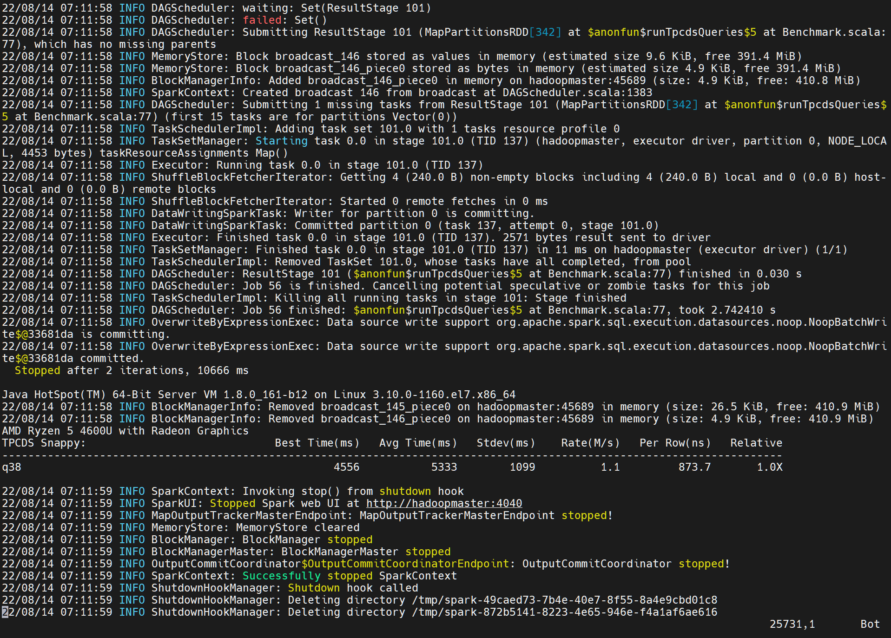

# finalTask

题目一: 分析一条 TPCDS SQL  
分析一条 TPCDS SQL（请基于 Spark 3.1.1 版本解答）

* 运行该 SQL，如 q38，并截图该 SQL 的 SQL 执行图
* 该 SQL 用到了哪些优化规则（optimizer rules）
* 请各用不少于 200 字描述其中的两条优化规则

PS:SQL 从中任意选择一条：https://github.com/apache/spark/tree/master/sql/core/src/test/resources/tpcds

### 从 github 下载 TPCDS 数据生成器
> git clone https://github.com/maropu/spark-tpcds-datagen.git
```git clone https://github.com/maropu/spark-tpcds-datagen.git
Cloning into 'spark-tpcds-datagen'...
remote: Enumerating objects: 4686, done.
remote: Counting objects: 100% (505/505), done.
remote: Compressing objects: 100% (143/143), done.
remote: Total 4686 (delta 333), reused 500 (delta 332), pack-reused 4181
Receiving objects: 100% (4686/4686), 36.14 MiB | 10.96 MiB/s, done.
Resolving deltas: 100% (2760/2760), done.
```
> cd spark-tpcds-datagen

### 下载 Spark3.1.1 到 spark-tpcds-datagen 目录并解压
> wget https://archive.apache.org/dist/spark/spark-3.1.1/spark-3.1.1-bin-hadoop2.7.tgz
```
wget https://archive.apache.org/dist/spark/spark-3.1.1/spark-3.1.1-bin-hadoop2.7.tgz
--2022-08-14 05:54:42--  https://archive.apache.org/dist/spark/spark-3.1.1/spark-3.1.1-bin-hadoop2.7.tgz
Resolving archive.apache.org (archive.apache.org)... 138.201.131.134, 2a01:4f8:172:2ec5::2
Connecting to archive.apache.org (archive.apache.org)|138.201.131.134|:443... connected.
HTTP request sent, awaiting response... 200 OK
Length: 224374704 (214M) [application/x-gzip]
Saving to: ‘spark-3.1.1-bin-hadoop2.7.tgz’

100%[==============================================================================================>] 224,374,704 6.52MB/s   in 2m 11s

2022-08-14 05:56:53 (1.64 MB/s) - ‘spark-3.1.1-bin-hadoop2.7.tgz’ saved [224374704/224374704]
```
> tar -zxvf spark-3.1.1-bin-hadoop2.7.tgz

### 生成数据
> mkdir -p tpcds-data-1g  
> vim ~/.bashrc
```bash
// 添加如下内容
export SPARK_HOME=/home/hadoop/geektime/spark-tpcds-datagen/spark-3.1.1-bin-hadoop2.7
```
> source ~/.bashrc  
> echo $SPARK_HOME
```
>> /home/hadoop/geektime/spark-tpcds-datagen/spark-3.1.1-bin-hadoop2.7
```
> ./bin/dsdgen --output-location tpcds-data-1g
```
// 部分执行日志
./bin/dsdgen --output-location tpcds-data-1g/
/home/hadoop/geektime/spark-tpcds-datagen/bin/../target/spark-tpcds-datagen_2.12-0.1.0-SNAPSHOT-with-dependencies.jar not found, so use pre-compiled /home/hadoop/geektime/spark-tpcds-datagen/bin/../assembly/spark-tpcds-datagen_2.12-0.1.0-SNAPSHOT-with-dependencies.jar
Using `spark-submit` from path: /home/hadoop/geektime/spark-tpcds-datagen/spark-3.1.1-bin-hadoop2.7
22/08/14 06:31:45 WARN NativeCodeLoader: Unable to load native-hadoop library for your platform... using builtin-java classes where applicable
Using Spark's default log4j profile: org/apache/spark/log4j-defaults.properties
22/08/14 06:31:46 INFO SparkContext: Running Spark version 3.1.1
22/08/14 06:31:46 INFO ResourceUtils: ==============================================================
22/08/14 06:31:46 INFO ResourceUtils: No custom resources configured for spark.driver.
22/08/14 06:31:46 INFO ResourceUtils: ==============================================================
22/08/14 06:31:46 INFO SparkContext: Submitted application: org.apache.spark.sql.execution.benchmark.TPCDSDatagen
22/08/14 06:31:46 INFO ResourceProfile: Default ResourceProfile created, executor resources: Map(cores -> name: cores, amount: 1, script: , vendor: , memory -> name: memory, amount: 1024, script: , vendor: , offHeap -> name: offHeap, amount: 0, script: , vendor: ), task resources: Map(cpus -> name: cpus, amount: 1.0)
22/08/14 06:31:46 INFO ResourceProfile: Limiting resource is cpu
22/08/14 06:31:46 INFO ResourceProfileManager: Added ResourceProfile id: 0
22/08/14 06:31:46 INFO SecurityManager: Changing view acls to: hadoop
22/08/14 06:31:46 INFO SecurityManager: Changing modify acls to: hadoop
22/08/14 06:31:46 INFO SecurityManager: Changing view acls groups to:
22/08/14 06:31:46 INFO SecurityManager: Changing modify acls groups to:
22/08/14 06:31:46 INFO SecurityManager: SecurityManager: authentication disabled; ui acls disabled; users  with view permissions: Set(hadoop); groups with view permissions: Set(); users  with modify permissions: Set(hadoop); groups with modify permissions: Set()
22/08/14 06:31:47 INFO Utils: Successfully started service 'sparkDriver' on port 44462.
22/08/14 06:31:47 INFO SparkEnv: Registering MapOutputTracker
22/08/14 06:31:47 INFO SparkEnv: Registering BlockManagerMaster
22/08/14 06:31:47 INFO BlockManagerMasterEndpoint: Using org.apache.spark.storage.DefaultTopologyMapper for getting topology information
22/08/14 06:31:47 INFO BlockManagerMasterEndpoint: BlockManagerMasterEndpoint up
22/08/14 06:31:47 INFO SparkEnv: Registering BlockManagerMasterHeartbeat
22/08/14 06:31:47 INFO DiskBlockManager: Created local directory at /tmp/blockmgr-7ef91f0e-847f-48e7-b8a7-3ff35fe149bc
22/08/14 06:31:47 INFO MemoryStore: MemoryStore started with capacity 413.9 MiB
22/08/14 06:31:47 INFO SparkEnv: Registering OutputCommitCoordinator
22/08/14 06:31:47 INFO Utils: Successfully started service 'SparkUI' on port 4040.
22/08/14 06:31:47 INFO SparkUI: Bound SparkUI to 0.0.0.0, and started at http://hadoopmaster:4040
22/08/14 06:31:48 INFO SparkContext: Added JAR file:/home/hadoop/geektime/spark-tpcds-datagen/bin/../assembly/spark-tpcds-datagen_2.12-0.1.0-SNAPSHOT-with-dependencies.jar at spark://hadoopmaster:44462/jars/spark-tpcds-datagen_2.12-0.1.0-SNAPSHOT-with-dependencies.jar with timestamp 1660483906380
22/08/14 06:31:48 INFO Executor: Starting executor ID driver on host hadoopmaster
22/08/14 06:31:48 INFO Executor: Fetching spark://hadoopmaster:44462/jars/spark-tpcds-datagen_2.12-0.1.0-SNAPSHOT-with-dependencies.jar with timestamp 1660483906380
22/08/14 06:31:48 INFO TransportClientFactory: Successfully created connection to hadoopmaster/192.168.146.130:44462 after 81 ms (15 ms spent in bootstraps)
22/08/14 06:31:48 INFO Utils: Fetching spark://hadoopmaster:44462/jars/spark-tpcds-datagen_2.12-0.1.0-SNAPSHOT-with-dependencies.jar to /tmp/spark-b19d8f01-43bd-4452-a085-7cc5cd737013/userFiles-facafe8e-498a-46b1-9c6c-9870c6dc4b12/fetchFileTemp2266263852153528397.tmp
22/08/14 06:31:48 INFO Executor: Adding file:/tmp/spark-b19d8f01-43bd-4452-a085-7cc5cd737013/userFiles-facafe8e-498a-46b1-9c6c-9870c6dc4b12/spark-tpcds-datagen_2.12-0.1.0-SNAPSHOT-with-dependencies.jar to class loader
22/08/14 06:31:48 INFO Utils: Successfully started service 'org.apache.spark.network.netty.NettyBlockTransferService' on port 37787.
22/08/14 06:31:48 INFO NettyBlockTransferService: Server created on hadoopmaster:37787
22/08/14 06:31:48 INFO BlockManager: Using org.apache.spark.storage.RandomBlockReplicationPolicy for block replication policy
22/08/14 06:31:48 INFO BlockManagerMaster: Registering BlockManager BlockManagerId(driver, hadoopmaster, 37787, None)
22/08/14 06:31:48 INFO BlockManagerMasterEndpoint: Registering block manager hadoopmaster:37787 with 413.9 MiB RAM, BlockManagerId(driver, hadoopmaster, 37787, None)
22/08/14 06:31:48 INFO BlockManagerMaster: Registered BlockManager BlockManagerId(driver, hadoopmaster, 37787, None)
22/08/14 06:31:48 INFO BlockManager: Initialized BlockManager: BlockManagerId(driver, hadoopmaster, 37787, None)
22/08/14 06:31:50 INFO SharedState: Setting hive.metastore.warehouse.dir ('null') to the value of spark.sql.warehouse.dir ('file:/home/hadoop/geektime/spark-tpcds-datagen/spark-warehouse').
22/08/14 06:31:50 INFO SharedState: Warehouse path is 'file:/home/hadoop/geektime/spark-tpcds-datagen/spark-warehouse'.
22/08/14 06:31:56 WARN package: Truncated the string representation of a plan since it was too large. This behavior can be adjusted by setting 'spark.sql.debug.maxToStringFields'.
22/08/14 06:31:56 INFO ParquetFileFormat: Using default output committer for Parquet: org.apache.parquet.hadoop.ParquetOutputCommitter
22/08/14 06:31:56 INFO FileOutputCommitter: File Output Committer Algorithm version is 1
22/08/14 06:31:56 INFO SQLHadoopMapReduceCommitProtocol: Using user defined output committer class org.apache.parquet.hadoop.ParquetOutputCommitter
22/08/14 06:31:56 INFO FileOutputCommitter: File Output Committer Algorithm version is 1
22/08/14 06:31:56 INFO SQLHadoopMapReduceCommitProtocol: Using output committer class org.apache.parquet.hadoop.ParquetOutputCommitter
22/08/14 06:31:58 INFO CodeGenerator: Code generated in 718.019361 ms
22/08/14 06:31:58 INFO SparkContext: Starting job: main at NativeMethodAccessorImpl.java:0
22/08/14 06:31:58 INFO DAGScheduler: Got job 0 (main at NativeMethodAccessorImpl.java:0) with 1 output partitions
22/08/14 06:31:58 INFO DAGScheduler: Final stage: ResultStage 0 (main at NativeMethodAccessorImpl.java:0)
22/08/14 06:31:58 INFO DAGScheduler: Parents of final stage: List()
22/08/14 06:31:58 INFO DAGScheduler: Missing parents: List()
22/08/14 06:31:58 INFO DAGScheduler: Submitting ResultStage 0 (CoalescedRDD[6] at main at NativeMethodAccessorImpl.java:0), which has no missing parents
22/08/14 06:31:59 INFO MemoryStore: Block broadcast_0 stored as values in memory (estimated size 234.0 KiB, free 413.7 MiB)
22/08/14 06:31:59 INFO MemoryStore: Block broadcast_0_piece0 stored as bytes in memory (estimated size 71.0 KiB, free 413.6 MiB)
22/08/14 06:31:59 INFO BlockManagerInfo: Added broadcast_0_piece0 in memory on hadoopmaster:37787 (size: 71.0 KiB, free: 413.9 MiB)
22/08/14 06:31:59 INFO SparkContext: Created broadcast 0 from broadcast at DAGScheduler.scala:1383
22/08/14 06:31:59 INFO DAGScheduler: Submitting 1 missing tasks from ResultStage 0 (CoalescedRDD[6] at main at NativeMethodAccessorImpl.java:0) (first 15 tasks are for partitions Vector(0))
22/08/14 06:31:59 INFO TaskSchedulerImpl: Adding task set 0.0 with 1 tasks resource profile 0
22/08/14 06:31:59 INFO TaskSetManager: Starting task 0.0 in stage 0.0 (TID 0) (hadoopmaster, executor driver, partition 0, PROCESS_LOCAL, 4834 bytes) taskResourceAssignments Map()
22/08/14 06:31:59 INFO Executor: Running task 0.0 in stage 0.0 (TID 0)
22/08/14 06:32:00 INFO FileOutputCommitter: File Output Committer Algorithm version is 1
22/08/14 06:32:00 INFO SQLHadoopMapReduceCommitProtocol: Using user defined output committer class org.apache.parquet.hadoop.ParquetOutputCommitter
22/08/14 06:32:00 INFO FileOutputCommitter: File Output Committer Algorithm version is 1
22/08/14 06:32:00 INFO SQLHadoopMapReduceCommitProtocol: Using output committer class org.apache.parquet.hadoop.ParquetOutputCommitter
22/08/14 06:32:00 INFO CodecConfig: Compression: SNAPPY
22/08/14 06:32:00 INFO CodecConfig: Compression: SNAPPY
22/08/14 06:32:00 INFO ParquetOutputFormat: Parquet block size to 134217728
22/08/14 06:32:00 INFO ParquetOutputFormat: Parquet page size to 1048576
22/08/14 06:32:00 INFO ParquetOutputFormat: Parquet dictionary page size to 1048576
22/08/14 06:32:00 INFO ParquetOutputFormat: Dictionary is on
22/08/14 06:32:00 INFO ParquetOutputFormat: Validation is off
22/08/14 06:32:00 INFO ParquetOutputFormat: Writer version is: PARQUET_1_0
22/08/14 06:32:00 INFO ParquetOutputFormat: Maximum row group padding size is 8388608 bytes
22/08/14 06:32:00 INFO ParquetOutputFormat: Page size checking is: estimated
22/08/14 06:32:00 INFO ParquetOutputFormat: Min row count for page size check is: 100
22/08/14 06:32:00 INFO ParquetOutputFormat: Max row count for page size check is: 10000
22/08/14 06:32:00 INFO ParquetWriteSupport: Initialized Parquet WriteSupport with Catalyst schema:
{
  "type" : "struct",
  "fields" : [ {
    "name" : "cs_sold_date_sk",
    "type" : "integer",
    "nullable" : true,
    "metadata" : { }
  }, {
    "name" : "cs_sold_time_sk",
    "type" : "integer",
    "nullable" : true,
    "metadata" : { }
  }, {
    "name" : "cs_ship_date_sk",
    "type" : "integer",
    "nullable" : true,
    "metadata" : { }
  }, {
    "name" : "cs_bill_customer_sk",
    "type" : "integer",
    "nullable" : true,
    "metadata" : { }
  }, {
    "name" : "cs_bill_cdemo_sk",
    "type" : "integer",
    "nullable" : true,
    "metadata" : { }
  }, {
    "name" : "cs_bill_hdemo_sk",
    "type" : "integer",
    "nullable" : true,
    "metadata" : { }
  }, {
    "name" : "cs_bill_addr_sk",
    "type" : "integer",
    "nullable" : true,
    "metadata" : { }
  }, {
    "name" : "cs_ship_customer_sk",
    "type" : "integer",
    "nullable" : true,
    "metadata" : { }
  }, {
    "name" : "cs_ship_cdemo_sk",
    "type" : "integer",
    "nullable" : true,
    "metadata" : { }
  }, {
    "name" : "cs_ship_hdemo_sk",
    "type" : "integer",
    "nullable" : true,
    "metadata" : { }
  }, {
    "name" : "cs_ship_addr_sk",
    "type" : "integer",
    "nullable" : true,
    "metadata" : { }
  }, {
    "name" : "cs_call_center_sk",
    "type" : "integer",
    "nullable" : true,
    "metadata" : { }
  }, {
    "name" : "cs_catalog_page_sk",
    "type" : "integer",
    "nullable" : true,
    "metadata" : { }
  }, {
    "name" : "cs_ship_mode_sk",
    "type" : "integer",
    "nullable" : true,
    "metadata" : { }
  }, {
    "name" : "cs_warehouse_sk",
    "type" : "integer",
    "nullable" : true,
    "metadata" : { }
  }, {
    "name" : "cs_item_sk",
    "type" : "integer",
    "nullable" : true,
    "metadata" : { }
  }, {
    "name" : "cs_promo_sk",
    "type" : "integer",
    "nullable" : true,
    "metadata" : { }
  }, {
    "name" : "cs_order_number",
    "type" : "integer",
    "nullable" : true,
    "metadata" : { }
  }, {
    "name" : "cs_quantity",
    "type" : "integer",
    "nullable" : true,
    "metadata" : { }
  }, {
    "name" : "cs_wholesale_cost",
    "type" : "decimal(7,2)",
    "nullable" : true,
    "metadata" : { }
  }, {
    "name" : "cs_list_price",
    "type" : "decimal(7,2)",
    "nullable" : true,
    "metadata" : { }
  }, {
    "name" : "cs_sales_price",
    "type" : "decimal(7,2)",
    "nullable" : true,
    "metadata" : { }
  }, {
    "name" : "cs_ext_discount_amt",
    "type" : "decimal(7,2)",
    "nullable" : true,
    "metadata" : { }
  }, {
    "name" : "cs_ext_sales_price",
    "type" : "decimal(7,2)",
    "nullable" : true,
    "metadata" : { }
  }, {
    "name" : "cs_ext_wholesale_cost",
    "type" : "decimal(7,2)",
    "nullable" : true,
    "metadata" : { }
  }, {
    "name" : "cs_ext_list_price",
    "type" : "decimal(7,2)",
    "nullable" : true,
    "metadata" : { }
  }, {
    "name" : "cs_ext_tax",
    "type" : "decimal(7,2)",
    "nullable" : true,
    "metadata" : { }
  }, {
    "name" : "cs_coupon_amt",
    "type" : "decimal(7,2)",
    "nullable" : true,
    "metadata" : { }
  }, {
    "name" : "cs_ext_ship_cost",
    "type" : "decimal(7,2)",
    "nullable" : true,
    "metadata" : { }
  }, {
    "name" : "cs_net_paid",
    "type" : "decimal(7,2)",
    "nullable" : true,
    "metadata" : { }
  }, {
    "name" : "cs_net_paid_inc_tax",
    "type" : "decimal(7,2)",
    "nullable" : true,
    "metadata" : { }
  }, {
    "name" : "cs_net_paid_inc_ship",
    "type" : "decimal(7,2)",
    "nullable" : true,
    "metadata" : { }
  }, {
    "name" : "cs_net_paid_inc_ship_tax",
    "type" : "decimal(7,2)",
    "nullable" : true,
    "metadata" : { }
  }, {
    "name" : "cs_net_profit",
    "type" : "decimal(7,2)",
    "nullable" : true,
    "metadata" : { }
  } ]
}
and corresponding Parquet message type:
message spark_schema {
  optional int32 cs_sold_date_sk;
  optional int32 cs_sold_time_sk;
  optional int32 cs_ship_date_sk;
  optional int32 cs_bill_customer_sk;
  optional int32 cs_bill_cdemo_sk;
  optional int32 cs_bill_hdemo_sk;
  optional int32 cs_bill_addr_sk;
  optional int32 cs_ship_customer_sk;
  optional int32 cs_ship_cdemo_sk;
  optional int32 cs_ship_hdemo_sk;
  optional int32 cs_ship_addr_sk;
  optional int32 cs_call_center_sk;
  optional int32 cs_catalog_page_sk;
  optional int32 cs_ship_mode_sk;
  optional int32 cs_warehouse_sk;
  optional int32 cs_item_sk;
  optional int32 cs_promo_sk;
  optional int32 cs_order_number;
  optional int32 cs_quantity;
  optional int32 cs_wholesale_cost (DECIMAL(7,2));
  optional int32 cs_list_price (DECIMAL(7,2));
  optional int32 cs_sales_price (DECIMAL(7,2));
  optional int32 cs_ext_discount_amt (DECIMAL(7,2));
  optional int32 cs_ext_sales_price (DECIMAL(7,2));
  optional int32 cs_ext_wholesale_cost (DECIMAL(7,2));
  optional int32 cs_ext_list_price (DECIMAL(7,2));
  optional int32 cs_ext_tax (DECIMAL(7,2));
  optional int32 cs_coupon_amt (DECIMAL(7,2));
  optional int32 cs_ext_ship_cost (DECIMAL(7,2));
  optional int32 cs_net_paid (DECIMAL(7,2));
  optional int32 cs_net_paid_inc_tax (DECIMAL(7,2));
  optional int32 cs_net_paid_inc_ship (DECIMAL(7,2));
  optional int32 cs_net_paid_inc_ship_tax (DECIMAL(7,2));
  optional int32 cs_net_profit (DECIMAL(7,2));
}


22/08/14 06:32:00 INFO CodecPool: Got brand-new compressor [.snappy]
DBGEN2 Population Generator (Version 1.0.0h (pre-release))
Copyright Transaction Processing Performance Council (TPC) 2001 - 2008
Warning: This scale factor is valid for QUALIFICATION ONLY
22/08/14 06:32:02 INFO CodeGenerator: Code generated in 622.567347 ms
......
```
### 下载三个 test jar 并放到当前目录
> wget https://repo1.maven.org/maven2/org/apache/spark/spark-catalyst_2.12/3.1.1/spark-catalyst_2.12-3.1.1-tests.jar
>
> wget https://repo1.maven.org/maven2/org/apache/spark/spark-core_2.12/3.1.1/spark-core_2.12-3.1.1-tests.jar
>
> wget https://repo1.maven.org/maven2/org/apache/spark/spark-sql_2.12/3.1.1/spark-sql_2.12-3.1.1-tests.jar
### 执行sql（这里执行q38的sql作为本次作业内容）
```sql
-- q38
SELECT count(*)
FROM (
       SELECT DISTINCT
         c_last_name,
         c_first_name,
         d_date
       FROM store_sales, date_dim, customer
       WHERE store_sales.ss_sold_date_sk = date_dim.d_date_sk
         AND store_sales.ss_customer_sk = customer.c_customer_sk
         AND d_month_seq BETWEEN 1200 AND 1200 + 11
       INTERSECT
       SELECT DISTINCT
         c_last_name,
         c_first_name,
         d_date
       FROM catalog_sales, date_dim, customer
       WHERE catalog_sales.cs_sold_date_sk = date_dim.d_date_sk
         AND catalog_sales.cs_bill_customer_sk = customer.c_customer_sk
         AND d_month_seq BETWEEN 1200 AND 1200 + 11
       INTERSECT
       SELECT DISTINCT
         c_last_name,
         c_first_name,
         d_date
       FROM web_sales, date_dim, customer
       WHERE web_sales.ws_sold_date_sk = date_dim.d_date_sk
         AND web_sales.ws_bill_customer_sk = customer.c_customer_sk
         AND d_month_seq BETWEEN 1200 AND 1200 + 11
     ) hot_cust
LIMIT 100
```
> ./spark-3.1.1-bin-hadoop2.7/bin/spark-submit --conf spark.sql.planChangeLog.level=WARN --class org.apache.spark.sql.execution.benchmark.TPCDSQueryBenchmark --jars spark-core_2.12-3.1.1-tests.jar,spark-catalyst_2.12-3.1.1-tests.jar spark-sql_2.12-3.1.1-tests.jar --data-location tpcds-data-1g --query-filter "q38" > spark311.q38.log 2>&1
### 执行截图


执行日志文件在spark311.q38.log中[spark311.q38.log](spark311.q38.log)
> grep "Applying Rule org.apache.spark.sql.catalyst.optimizer" spark311.q38.log | sort | uniq -c > spark311_q38_optimizer.log

### 展示该sql执行用到的优化规则
```
      3 === Applying Rule org.apache.spark.sql.catalyst.optimizer.CollapseProject ===
     42 === Applying Rule org.apache.spark.sql.catalyst.optimizer.ColumnPruning ===
      3 === Applying Rule org.apache.spark.sql.catalyst.optimizer.ConstantFolding ===
      3 === Applying Rule org.apache.spark.sql.catalyst.optimizer.EliminateLimits ===
      3 === Applying Rule org.apache.spark.sql.catalyst.optimizer.InferFiltersFromConstraints ===
     18 === Applying Rule org.apache.spark.sql.catalyst.optimizer.PushDownLeftSemiAntiJoin ===
      9 === Applying Rule org.apache.spark.sql.catalyst.optimizer.PushDownPredicates ===
     15 === Applying Rule org.apache.spark.sql.catalyst.optimizer.RemoveNoopOperators ===
      3 === Applying Rule org.apache.spark.sql.catalyst.optimizer.ReorderJoin ===
      3 === Applying Rule org.apache.spark.sql.catalyst.optimizer.ReplaceDistinctWithAggregate ===
      3 === Applying Rule org.apache.spark.sql.catalyst.optimizer.ReplaceIntersectWithSemiJoin ===
      3 === Applying Rule org.apache.spark.sql.catalyst.optimizer.RewritePredicateSubquery ===
```

### 挑选两条优化规则描述
#### ColumnPruning 列裁剪
列裁剪目的：**过滤掉查询不需要使用到的列**

```
列裁剪ColumnPruning 指把那些查询不需要的字段过滤掉，使得扫描的数据量减少。
如果底层的文件格式为列式存储（比如 Parquet）则可以进一步映射下推，映射可以理解为表结构映射，Parquet每一列的所有值都是连续存储的，所以分区取出每一列的所有值就可以出现TableScan算子，而避免扫描整个表文件内容。
该优化大幅度减少了网络、内存数据量消耗，对于列存格式（Parquet）来说也大大提高了扫描效率。
```
#### PushDownPredicates 谓词下推
谓词下推规则：主要将过滤条件尽可能地下推到底层，最好是贴近数据源。

```
谓词可以下推的前提：不影响查询结果，即要保证下推前和下推后两个sql执行得到的效果相同。
主要是把filter操作尽可能下推到贴近数据源的地方，这样做可以将计算转移至数据源端，减少加载和计算的数据量。
filter时，project字段必须是确定性的才能下推，因为如果是非确定性的字段，下推前后查询结果可能不太一样，这点是非常重要的条件。
```
